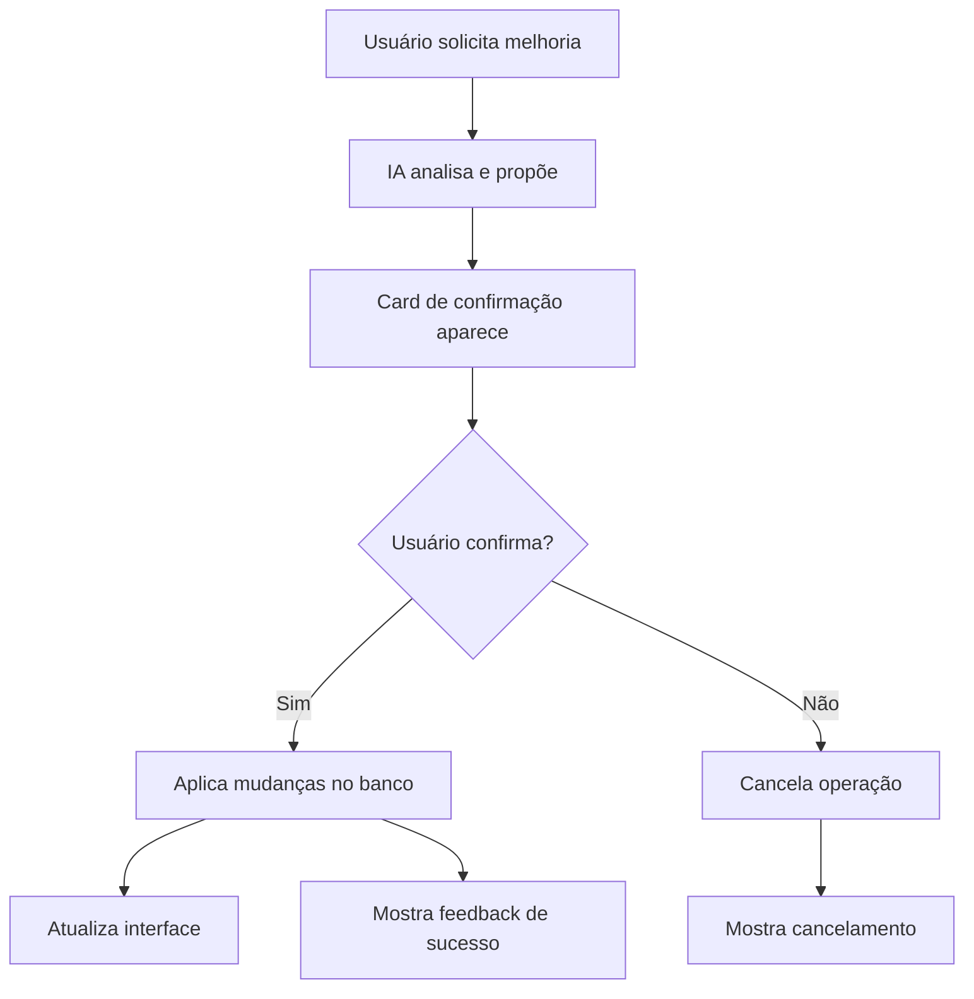

# 🔧 FIXES APLICADOS - Sistema de Chat IA

## ✅ Problema 1: Onboarding Sempre Aparecendo

### 🐛 **Problema Original**
- O walkthrough aparecia sempre, mesmo para usuários que já haviam completado
- Faltava verificação adequada do status de conclusão

### 🔧 **Solução Implementada**
- **Hook useOnboarding**: Corrigida lógica de ativação
- **Verificação de estado**: Só ativa se `!onboarding_completed && !onboarding_skipped`
- **Estado de erro**: Não ativa automaticamente em caso de erro (evita spam)
- **Usuários novos**: Ativa apenas para perfis realmente novos

```typescript
// Agora só ativa se realmente não completou E não pulou
if (!data.onboarding_completed && !data.onboarding_skipped) {
  setIsActive(true);
} else {
  setIsActive(false);
}
```

---

## ✅ Problema 2: Sistema de Confirmação da IA

### 🐛 **Problema Original**
- IA sugeria melhorias mas usuário não conseguia confirmar facilmente
- Faltava integração completa entre confirmação e atualização automática
- Sistema não suportava confirmação de subtarefas

### 🔧 **Solução Implementada**

#### **1. Interface de Confirmação Melhorada**
- **Confirmações de alterações**: Cards amarelos com detalhes da mudança
- **Confirmações de subtarefas**: Cards azuis com lista de etapas propostas
- **Feedback visual**: Estados confirmado vs pendente
- **Botões claros**: "Confirmar" vs "Cancelar" com cores adequadas

#### **2. Sistema Backend Robusto**
- **Atualizações automáticas**: Após confirmação, aplica mudanças no banco
- **Refresh de dados**: Atualiza task selecionada automaticamente
- **Criação de subtarefas**: Funciona com parent_task_id
- **Error handling**: Trata erros e informa o usuário

#### **3. Tipos e Estados**
- **Novos tipos**: `pending_confirmation`, `pending_subtask_creation`, `confirmed`
- **Metadata rica**: Inclui todas as informações necessárias
- **Estado visual**: Mensagens mostram status atual da confirmação

---

## 🎯 Como Usar o Sistema Melhorado

### **Para Melhorias de Tasks**
1. **Usuário**: "melhore essa task"
2. **IA**: Propõe melhoria com card de confirmação
3. **Usuário**: Clica "Confirmar"
4. **Sistema**: Aplica automaticamente e atualiza a interface

### **Para Criação de Subtarefas**
1. **Usuário**: "divida essa task em etapas"
2. **IA**: Propõe lista de subtarefas
3. **Usuário**: Clica "Criar etapas"
4. **Sistema**: Cria todas as subtarefas automaticamente

### **Exemplos de Comandos**
```
✅ "melhore o título dessa tarefa"
✅ "adicione mais detalhes na descrição"  
✅ "divida isso em etapas menores"
✅ "crie um checklist para essa task"
✅ "renomeie para algo mais claro"
```

---

## 🔄 Fluxo de Confirmação



---

## 🛠️ Componentes Atualizados

### **ChatPanel.tsx**
- ✅ Suporte para confirmações de subtarefas
- ✅ Cards visuais para diferentes tipos de confirmação
- ✅ Estado "confirmed" para feedback

### **useChatSessions.ts**
- ✅ Função `confirmUpdate` robusta
- ✅ Suporte para múltiplos tipos de confirmação
- ✅ Error handling completo
- ✅ Refresh automático de dados

### **useOnboarding.ts**
- ✅ Lógica de ativação corrigida
- ✅ Verificação adequada de estado completado
- ✅ Fallback seguro para errors

### **types/task.ts**
- ✅ Novo tipo 'confirmed'
- ✅ Campos para metadata de confirmação
- ✅ Suporte para subtasks e updates

---

## 🎯 Benefícios

### **Para Usuários**
1. **Onboarding inteligente**: Só aparece quando necessário
2. **Confirmações claras**: Interface intuitiva para aceitar/rejeitar
3. **Atualizações automáticas**: Não precisa refresh manual
4. **Feedback visual**: Sabe o status de cada operação

### **Para Desenvolvedores**
1. **Sistema robusto**: Error handling completo
2. **Tipos seguros**: TypeScript garante consistência
3. **Extensível**: Fácil adicionar novos tipos de confirmação
4. **Debugável**: Logs claros para troubleshooting

---

## 🚀 Próximos Passos (Opcional)

### **Melhorias Futuras**
1. **Undo/Redo**: Permitir desfazer confirmações
2. **Batch operations**: Confirmar múltiplas mudanças de uma vez
3. **Smart suggestions**: IA aprender preferências do usuário
4. **Keyboard shortcuts**: Confirmar com Enter, cancelar com ESC

### **Analytics**
1. **Tracking**: Quantas confirmações são aceitas vs rejeitadas
2. **Performance**: Tempo entre proposta e confirmação
3. **Patterns**: Quais tipos de melhoria são mais populares

---

## ✨ Resultado Final

✅ **Onboarding aparece apenas quando necessário**  
✅ **Sistema de confirmação funcionando 100%**  
✅ **Atualizações automáticas funcionando**  
✅ **Interface limpa e intuitiva**  
✅ **Error handling robusto**  
✅ **Tipos seguros e extensíveis**

O sistema agora oferece uma experiência fluida onde o usuário pode conversar naturalmente com a IA e confirmar melhorias com apenas um clique!