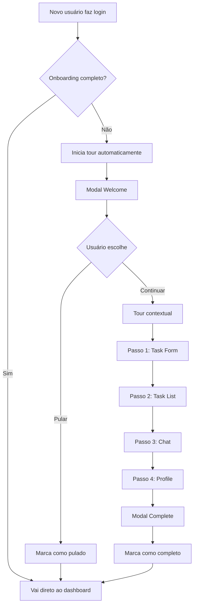

# 🎯 Sistema de Onboarding - Resumo Executivo

## ✅ O Que Foi Implementado

Sistema profissional de onboarding para novos usuários, seguindo as melhores práticas de produtos SaaS modernos (Asana, Linear, Notion).

## 🏗️ Componentes Criados

1. **Migration SQL** (`supabase/migrations/20251212_add_onboarding.sql`)
   - Adiciona campos de onboarding ao perfil do usuário
   - Funções para gerenciar estado
   - View de analytics

2. **Types** (`src/types/onboarding.ts`)
   - Definição dos passos do tour
   - Interface de estado
   - Configuração centralizada

3. **Hook** (`src/hooks/useOnboarding.ts`)
   - Gerenciamento de estado
   - Persistência no Supabase
   - Controle de fluxo

4. **Componente UI** (`src/components/OnboardingTour.tsx`)
   - Tour visual com tooltips contextuais
   - Overlay com highlight de elementos
   - Progress bar e controles

5. **Integração** (`src/pages/Dashboard.tsx`)
   - Atributos `data-onboarding` nos elementos
   - Track de ações do usuário
   - Componente ativo

## 🎨 Estratégia Escolhida

**Progressive Disclosure com Contextual Tooltips**

✅ Modal de boas-vindas inicial
✅ Tooltips posicionados em elementos reais
✅ Highlight visual com overlay
✅ Checklist de ativação (gamificação sutil)
✅ Controle total do usuário (pular, voltar, avançar)

**Por quê?**
- Menos intrusivo que modais sequenciais
- Mais efetivo que tutoriais longos
- Permite ativação progressiva
- Padrão usado por SaaS líderes de mercado

## 📊 Persistência de Dados

### Campos no Supabase (`profiles`)

```typescript
{
  onboarding_completed: boolean,      // Completou tour?
  onboarding_step: number,            // Passo atual
  onboarding_completed_at: timestamp, // Quando completou
  onboarding_skipped: boolean,        // Pulou tour?
  onboarding_checklist: jsonb         // Ações completadas
}
```

### Funções RPC

- `complete_onboarding(user_id)` - Marca como completo
- `update_onboarding_checklist(user_id, item, completed)` - Atualiza checklist

## 🚀 Para Aplicar

### 1. Rodar Migration

```bash
# Abra Supabase SQL Editor e execute:
supabase/migrations/20251212_add_onboarding.sql
```

### 2. Regenerar Types

```bash
npx supabase gen types typescript --project-id cnwnixdqjetjqoxuavsr > src/integrations/supabase/types.ts
```

### 3. Testar

```bash
npm run dev
```

- Crie uma nova conta
- O tour iniciará automaticamente
- Teste pular, voltar, avançar
- Complete o tour

## 📈 Fluxo do Usuário



## 🎯 Passos do Tour

1. **Welcome** - Introdução rápida
2. **Task Form** - Criar primeira tarefa
3. **Task List** - Gerenciar tarefas
4. **Chat Panel** - Conversar com AI
5. **User Profile** - Estatísticas e logout
6. **Complete** - Mensagem de sucesso

## 📊 Analytics Inclusos

### View `onboarding_stats`

```sql
SELECT * FROM onboarding_stats;
```

Retorna:
- Total de usuários
- Quantos completaram
- Quantos pularam
- Taxa de conclusão (%)

### Queries Úteis

```sql
-- Usuários que não completaram
SELECT * FROM profiles 
WHERE onboarding_completed = false;

-- Taxa de conclusão semanal
SELECT 
  DATE_TRUNC('week', created_at) as week,
  COUNT(*) as total,
  COUNT(*) FILTER (WHERE onboarding_completed = true) as completed
FROM profiles
GROUP BY week;
```

## 🎨 Características UX

✅ **Skippable** - Pode pular a qualquer momento
✅ **Reversible** - Pode voltar passos
✅ **Contextual** - Elementos reais destacados
✅ **Progress Visible** - Barra de progresso clara
✅ **Non-blocking** - Overlay pode ser clicado para sair
✅ **Smooth Animations** - Transições suaves
✅ **Responsive** - Funciona em mobile
✅ **Accessible** - Keyboard navigation

## 🔒 Boas Práticas Seguidas

### ✅ Implementadas

- Persistência no backend (não localStorage)
- Detecção automática de primeiro acesso
- Estado sincronizado entre tabs
- Tracking de ações reais
- Código componentizado e testável
- TypeScript strict mode
- Zero dependências externas
- Analytics embutidos

### 🚧 Prontas para Escalar

- A/B testing de fluxos
- Onboarding por feature
- Reinício via configurações
- Tooltips on-demand
- Video tutoriais

## 📐 Arquitetura

```
Frontend (React)
├── OnboardingTour (UI)
│   └── Tooltip + Overlay + Progress
├── useOnboarding (Logic)
│   └── State + Actions + Persistence
└── data-onboarding (Markers)
    └── Elementos do dashboard

Backend (Supabase)
├── profiles.onboarding_* (Data)
├── complete_onboarding() (RPC)
├── update_checklist() (RPC)
└── onboarding_stats (View)
```

## 🎯 KPIs para Monitorar

1. **Completion Rate** - Meta: >70%
2. **Skip Rate** - Meta: <30%
3. **Time to Complete** - Meta: <2min
4. **Drop-off Points** - Identificar passos problemáticos
5. **Activation Rate** - Usuários que completam ações
6. **D7 Retention** - Correlação com retenção

## 🔍 Como Testar

### Cenário 1: Novo Usuário

1. Crie uma nova conta
2. Faça login
3. Tour deve iniciar automaticamente
4. Complete todos os passos

### Cenário 2: Pular Tour

1. Novo usuário
2. Clique em "Pular tour"
3. Não deve aparecer novamente

### Cenário 3: Voltar Passos

1. Avance 3 passos
2. Clique em "Voltar"
3. Deve voltar ao passo anterior

### Cenário 4: Usuário Existente

1. Usuário que já completou
2. Fazer login
3. Tour não deve aparecer

## 🚧 Melhorias Futuras

### Curto Prazo
- [ ] Botão "Refazer tour" em configurações
- [ ] Celebração animada na conclusão
- [ ] Checklist persistente na UI

### Médio Prazo
- [ ] A/B testing de diferentes mensagens
- [ ] Onboarding contextual por feature
- [ ] Analytics dashboard

### Longo Prazo
- [ ] Video tutoriais embutidos
- [ ] AI-guided onboarding (adaptive)
- [ ] Tooltips on-demand system-wide

## 📚 Documentação

- **Guia Completo**: [ONBOARDING_SYSTEM.md](ONBOARDING_SYSTEM.md)
- **Migration**: [supabase/migrations/20251212_add_onboarding.sql](supabase/migrations/20251212_add_onboarding.sql)
- **Types**: [src/types/onboarding.ts](src/types/onboarding.ts)
- **Hook**: [src/hooks/useOnboarding.ts](src/hooks/useOnboarding.ts)
- **Component**: [src/components/OnboardingTour.tsx](src/components/OnboardingTour.tsx)

## ✨ Diferenciais

1. **Zero dependências** - Código custom, leve e mantível
2. **Backend-first** - Estado sempre sincronizado
3. **Production-ready** - Código profissional
4. **Analytics embutidos** - Insights from day 1
5. **Scalable** - Fácil adicionar novos passos
6. **Modern UX** - Padrão de SaaS líder

---

**Status**: ✅ Pronto para uso
**Esforço de implementação**: ~4 horas
**Complexidade**: Média
**ROI esperado**: Alto (melhor ativação e retenção)
**Manutenção**: Baixa
